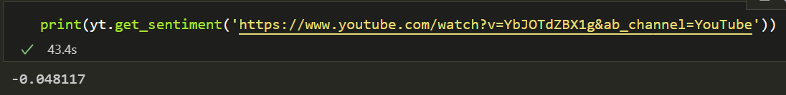
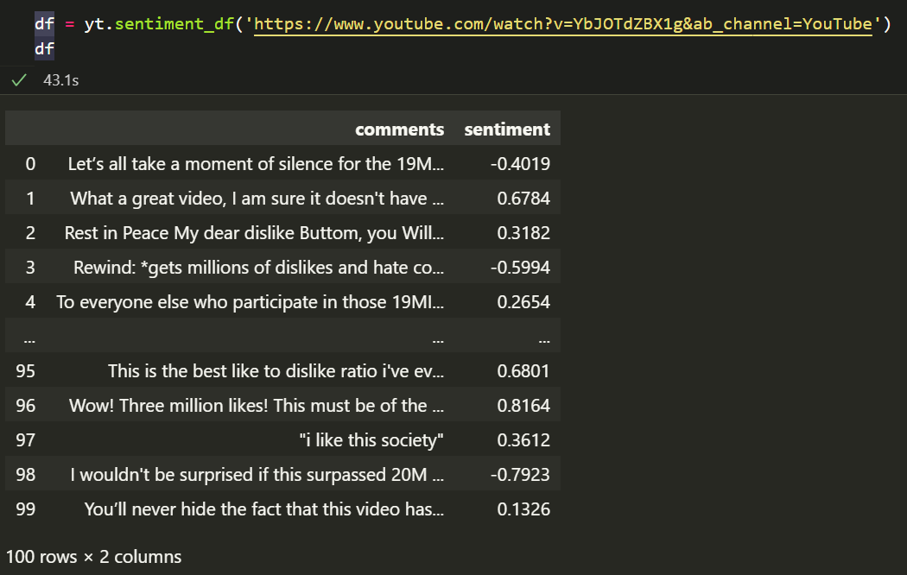
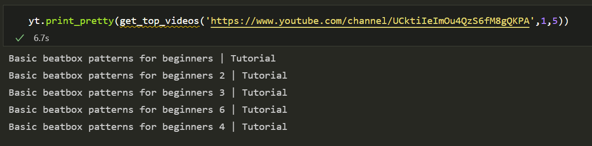

# Youtube-Sentiment

## Overview:  
  
Youtube has removed the dislike button. The fun of disliking terrible videos like Youtube rewind are gone. Fortunately, this project can give a user insight to the sentiment of a video based on the top 50 comments. 

The class in **youtube-sentiment.ipynb** allows you to do any of the following:

- Get a list of the top 100 comments of a video and their respective sentiments
- Get the overall sentiment of a video based on the top 100 comments
- Get a list of the top n videos of a channel sorted by popularity, newest releases, or oldest releases

## Examples:
  
### Getting the overall sentiment of a video:
 
    
This video is Youtube Rewind 2018, the most disliked video of all time. The sentiment is not as low as expected due to the large amounts of sarcasm in the comment section.
  
### Getting the top 100 comments and their sentiments:

   
It can be seen that many of the comments are clearly sarcastic but VADER does not pick up on that.
    
### Getting the top 5 videos from a channel:

Easteregg! This is from my personal Youtube channel
  
## How to use:  
pip install selenium  
pip install beautifulsoup4  
pip install vader  
pip install webdriver  

Only use youtube-sentiment.ipynb, the other notebooks are purely for testing  
Notes can be found in docstrings for each method that include all parameters, and outputs

## Notes:  
- Used BeautifulSoup for video scraping  
- Used Selenium for comment scraping - Beautifulsoup does not work for comments as comments are rendered dynamically.    
- Used Vader for NLP - Vader was chosen against Flair and Textblob as it understands internet lingo up to a certain extent. Vader was built specifically for analysing social media and an example can be seen below. Unfortunately, Vader cannot understand sarcasm.
    ex:   
`sentiment_dict = obj.polarity_scores('I love pizza')
print(sentiment_dict)`  
`{'neg': 0.0, 'neu': 0.323, 'pos': 0.677, 'compound': 0.6369}`  
`sentiment_dict = obj.polarity_scores('I LOVE pizza!!')
print(sentiment_dict)`  
`{'neg': 0.0, 'neu': 0.266, 'pos': 0.734, 'compound': 0.7592}`
